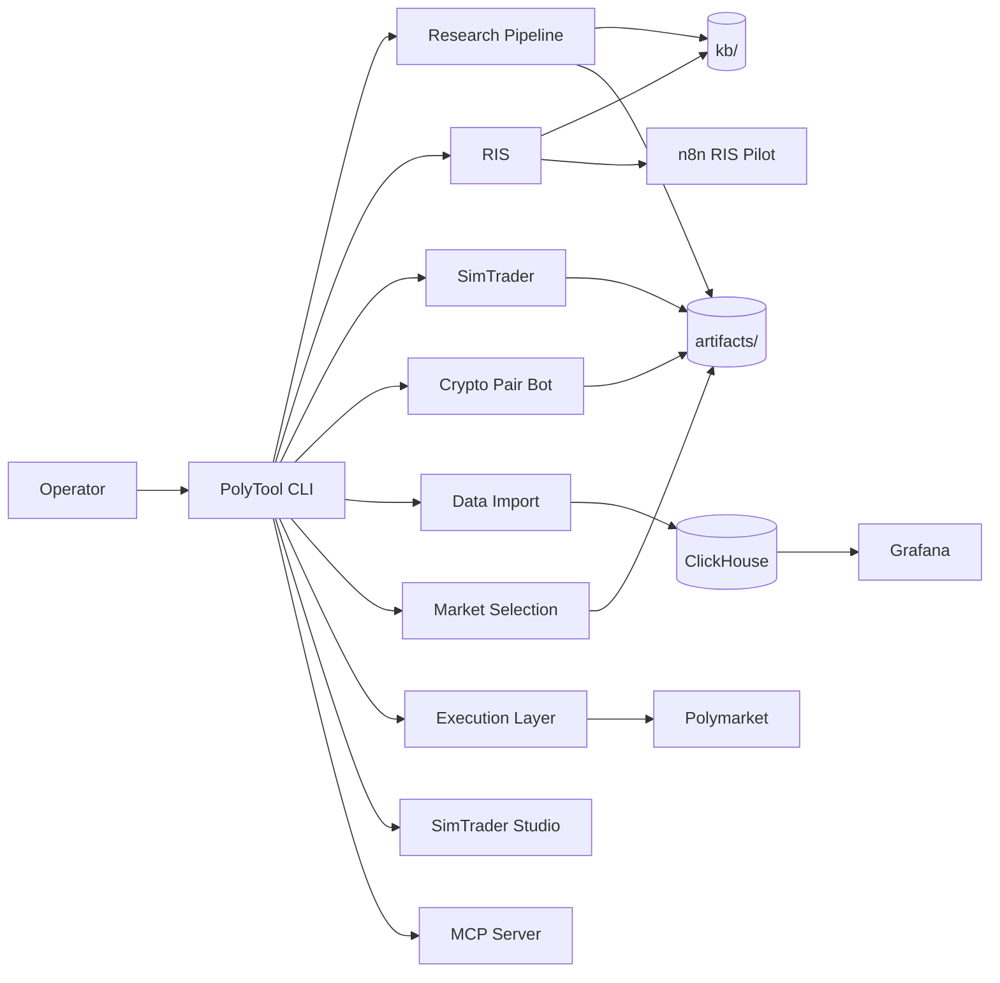
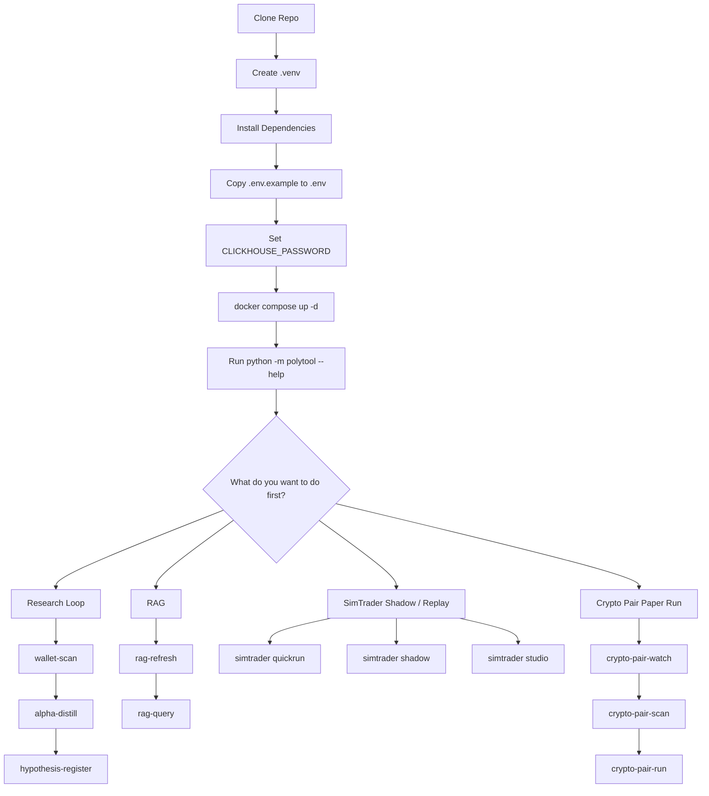
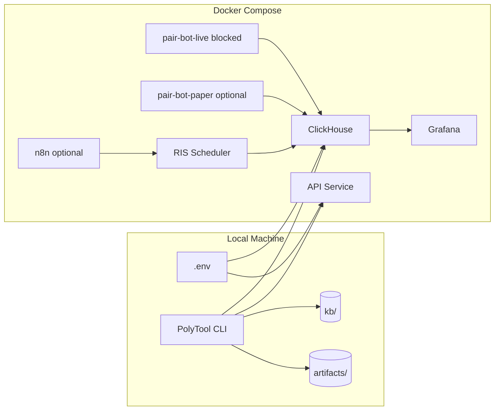

<objective>
Add exactly 3 Mermaid diagrams to README.md and create a companion Obsidian vault source doc.

Purpose: Improve visual orientation for operators reading the README on GitHub; maintain diagram source in the existing Obsidian vault for future editing.

Output: Updated README.md with 3 diagrams, new `docs/obsidian-vault/01-Architecture/Visual-Maps.md`, dev log.
</objective>

<execution_context>
@D:/Coding Projects/Polymarket/PolyTool/.claude/get-shit-done/workflows/execute-plan.md
@D:/Coding Projects/Polymarket/PolyTool/.claude/get-shit-done/templates/summary.md
</execution_context>

<context>
@README.md
@docs/obsidian-vault/01-Architecture/System-Overview.md

The README is 463 lines. Key section boundaries (line numbers from current file):
- Lines 1-16: Title, intro, "What PolyTool is NOT"
- Line 17: first `---` separator
- Lines 18-53: "What Is Shipped Today" + gate status + experimental
- Line 55: second `---`
- Lines 56-113: Prerequisites + Installation
- Line 115: `---`
- Lines 116-176: Configuration (env, docker, profiles, bootstrap, tests)
- Line 178: `---`
- Lines 179-257: Quick Workflows
- Lines 259: `---`
- Lines 260-393: Complete CLI Command Reference
- Line 394: `---`
- Lines 395-405: Operator Surfaces
- Line 406: `---`
- Lines 407-433: Project Structure
- Lines 435+: Deeper Documentation, Security, License

Obsidian vault lives at `docs/obsidian-vault/`. Architecture docs are in `docs/obsidian-vault/01-Architecture/` (existing files: System-Overview.md, Data-Stack.md, Database-Rules.md, LLM-Policy.md, Risk-Framework.md, Tape-Tiers.md).
</context>

<tasks>

<task type="auto">
  <name>Task 1: Insert 3 Mermaid diagrams into README.md</name>
  <files>README.md</files>
  <action>
Insert exactly 3 Mermaid diagram blocks into the existing README.md at the following locations. Do NOT rewrite surrounding content -- only add the intro sentence + diagram block at each insertion point.

**Diagram A -- High-level system map:**
Insert AFTER line 16 (end of "What PolyTool is NOT" bullet list) and BEFORE line 17 (the first `---` separator). Add a blank line, then:

```
### System Map

The diagram below shows how the operator CLI connects to every major subsystem.


```

**Diagram B -- First-time operator path:**
Insert AFTER the Configuration section's final code block / test count line (after line 176, the "```" closing the pytest expected baseline) and BEFORE line 178 (the `---` separator that precedes Quick Workflows). Add a blank line, then:

```
### First-Time Operator Path

Once infrastructure is running, pick a workflow to try first.


```

**Diagram C -- Infrastructure and operator surfaces map:**
Insert AFTER the Operator Surfaces table (after line 405, the row ending with `| Scoped RIS ingestion only; see ADR 0013 |`) and BEFORE line 406 (the `---` separator that precedes Project Structure). Add a blank line, then:

```
### Infrastructure and Operator Surfaces Map

How CLI, Docker services, and local storage connect.


```

IMPORTANT constraints:
- Do NOT modify any existing text, tables, code blocks, or section headers.
- Each insertion is additive only: intro sentence + Mermaid block + blank line.
- Use triple-backtick `mermaid` fenced blocks (GitHub-compatible).
- Result should have exactly 3 occurrences of "```mermaid" in the final file.
  </action>
  <verify>
    <automated>grep -c '```mermaid' "D:/Coding Projects/Polymarket/PolyTool/README.md"</automated>
  </verify>
  <done>README.md contains exactly 3 Mermaid diagram blocks at the specified locations. No existing content is modified. File renders correctly on GitHub.</done>
</task>

<task type="auto">
  <name>Task 2: Create companion Obsidian doc and dev log</name>
  <files>docs/obsidian-vault/01-Architecture/Visual-Maps.md, docs/dev_logs/2026-04-08_readme_visual_uplift.md</files>
  <action>
**Companion Obsidian doc** at `docs/obsidian-vault/01-Architecture/Visual-Maps.md`:

Create a new Markdown file containing all 3 Mermaid diagrams in one maintainable document. Structure:

```markdown
# Visual Maps

Mermaid diagram source for the 3 README.md visual maps. Edit here, then copy
updated blocks into `README.md`.

See also: [[System-Overview]]

## Diagram A -- System Map

```mermaid
[exact Diagram A block from Task 1]
```

## Diagram B -- First-Time Operator Path

```mermaid
[exact Diagram B block from Task 1]
```

## Diagram C -- Infrastructure and Operator Surfaces

```mermaid
[exact Diagram C block from Task 1]
```
```

Use the exact same Mermaid source as Task 1 (identical node IDs, labels, and edges).

**Dev log** at `docs/dev_logs/2026-04-08_readme_visual_uplift.md`:

Create with this structure:

```markdown
# README Visual Uplift

**Date:** 2026-04-08
**Scope:** docs-only (README.md + Obsidian vault companion)

## What Changed

- Added 3 Mermaid diagrams to `README.md`:
  - **System Map** (after intro, before "What Is Shipped Today")
  - **First-Time Operator Path** (after Configuration, before Quick Workflows)
  - **Infrastructure Map** (after Operator Surfaces table, before Project Structure)
- Created `docs/obsidian-vault/01-Architecture/Visual-Maps.md` as the
  single-source companion for maintaining all 3 diagrams.

## Why

The README had no visual orientation. Three targeted diagrams give new
operators a quick mental model without bloating the text.

## Files Touched

- `README.md` -- 3 additive Mermaid insertions
- `docs/obsidian-vault/01-Architecture/Visual-Maps.md` -- new companion doc
- `docs/dev_logs/2026-04-08_readme_visual_uplift.md` -- this log

## Verification

- `grep -c '```mermaid' README.md` returns `3`
- No code, config, or test files modified
```

IMPORTANT: Do NOT modify any other file. Only create these two new files.
  </action>
  <verify>
    <automated>test -f "D:/Coding Projects/Polymarket/PolyTool/docs/obsidian-vault/01-Architecture/Visual-Maps.md" && test -f "D:/Coding Projects/Polymarket/PolyTool/docs/dev_logs/2026-04-08_readme_visual_uplift.md" && echo "PASS" || echo "FAIL"</automated>
  </verify>
  <done>Both files exist. Companion doc contains all 3 identical Mermaid blocks. Dev log documents the change.</done>
</task>

</tasks>

<threat_model>
## Trust Boundaries

No trust boundaries apply -- this is a docs-only change with no code, no configuration, and no external service interaction.

## STRIDE Threat Register

| Threat ID | Category | Component | Disposition | Mitigation Plan |
|-----------|----------|-----------|-------------|-----------------|
| T-quick-01 | N/A | docs only | accept | No executable code or secrets touched; zero attack surface |
</threat_model>

<verification>
1. `grep -c '```mermaid' README.md` returns exactly `3`
2. `grep -c '```mermaid' docs/obsidian-vault/01-Architecture/Visual-Maps.md` returns exactly `3`
3. `test -f docs/dev_logs/2026-04-08_readme_visual_uplift.md` exits 0
4. `git diff --name-only` shows only the 3 expected files (README.md, Visual-Maps.md, dev log)
</verification>

<success_criteria>
- README.md has exactly 3 Mermaid diagram blocks at the specified locations
- No existing README content is modified (only additive insertions)
- Companion Obsidian doc exists at `docs/obsidian-vault/01-Architecture/Visual-Maps.md`
- Dev log exists at `docs/dev_logs/2026-04-08_readme_visual_uplift.md`
- No code, config, or test files are touched
</success_criteria>

<output>
After completion, create `.planning/quick/260408-k6r-add-3-mermaid-diagrams-to-readme-md-with/260408-k6r-SUMMARY.md`
</output>
