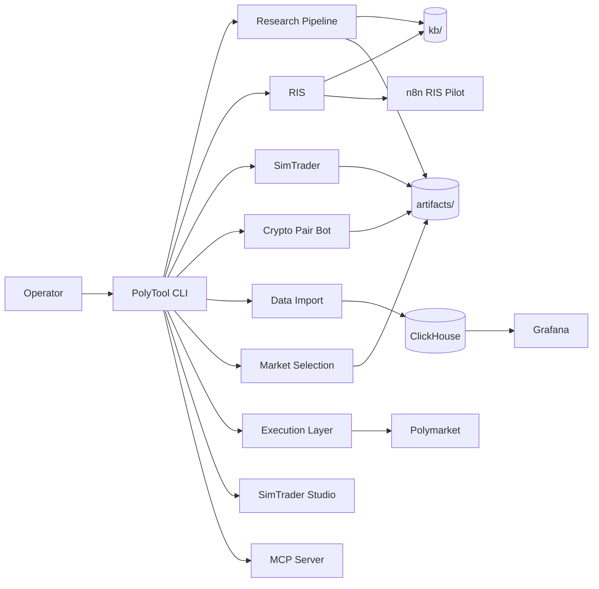
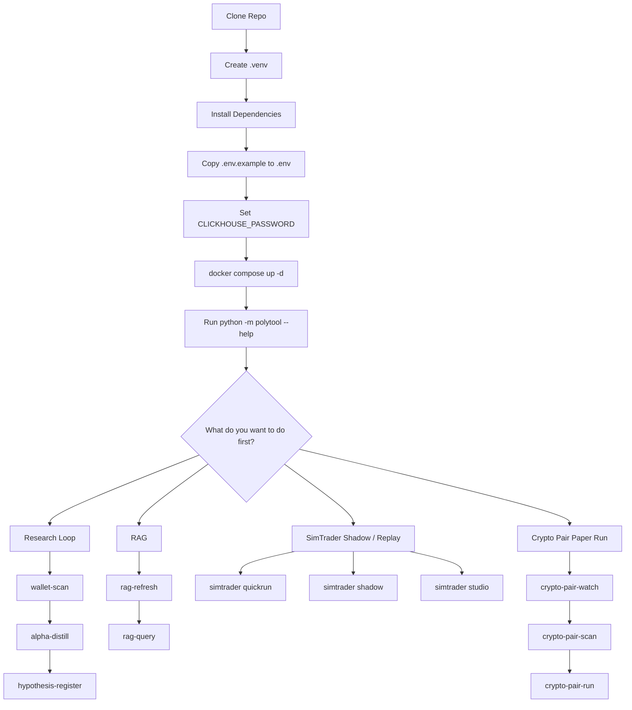
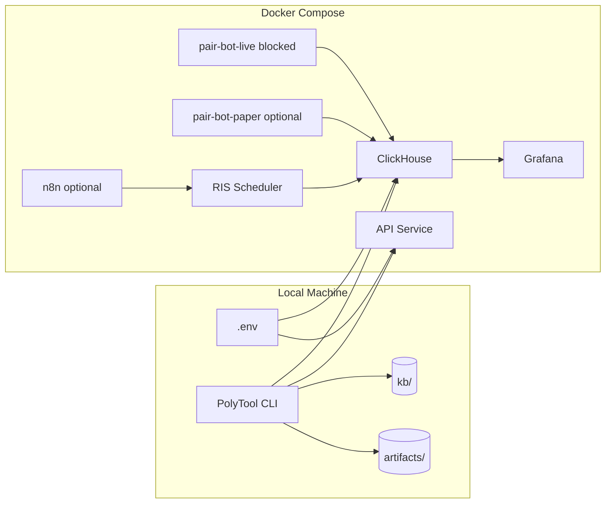

# Visual Maps

Mermaid diagram source for the 3 README.md visual maps. Edit here, then copy
updated blocks into `README.md`.

See also: [[System-Overview]]

## Diagram A -- System Map

## Diagram B -- First-Time Operator Path

## Diagram C -- Infrastructure and Operator Surfaces

