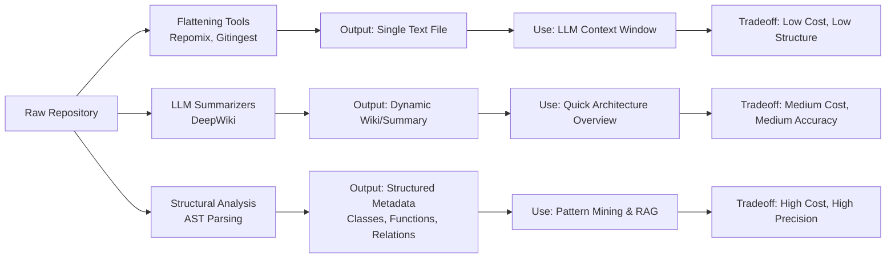
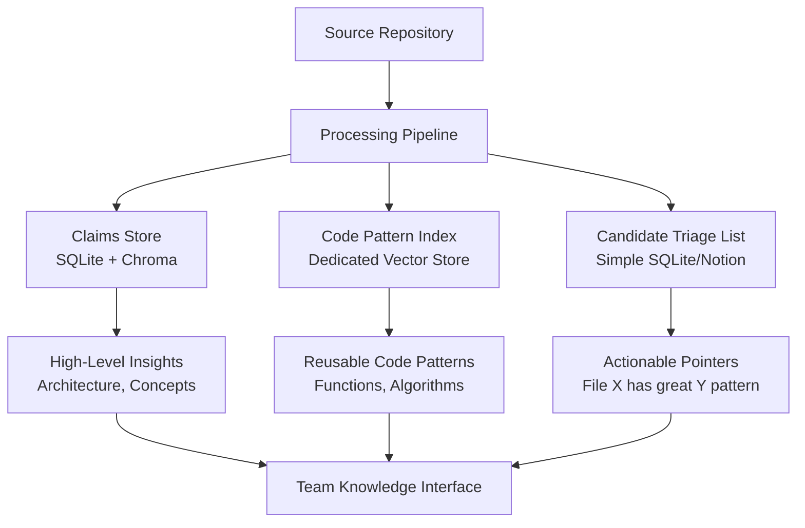

# GitHub Pipeline Survey — Prior Art, Discovery & Extraction

Three deep-research reports commissioned 2026-05-29 to scope the **GitHub ingestion branch of the RIS** (the "GitHub pipeline"): given a problem or capability we need, find unknown GitHub repos, evaluate them, and extract reusable code / evidence. Run as the prior-art step before any work packet, per the "guess nothing" discipline.

The GitHub pipeline is the code-source sibling of the academic pipeline (see [[claude-memory/research/research-scientific-rag-pipeline-survey]]). A `LiveGitHubFetcher` + `GithubAdapter` single-repo README path already exists; the `github` source family is already wired into the knowledge store (12-month freshness half-life) and the eval gate (credibility guidance: "weight activity, adoption, stars").

> Source-tool inline citation tokens have been stripped for readability; raw outputs live in the chat that produced this note. Reports 1 & 2 are ChatGPT Deep Research; Report 3 is a ChatGPT/GLM mix (mermaid diagrams preserved).

---

## Claude's synthesis — what this settles

**1. Build vs. integrate → build the orchestration, integrate the primitives.** No single off-the-shelf tool does the full discover → evaluate → extract loop. This is "mostly build-it-yourself, but not greenfield." The cheap, transparent, self-hostable stack is: GitHub Code Search + GraphQL (+ ecosyste.ms / libraries.io) for discovery & metadata scoring; repomix or gitingest for extraction; LlamaIndex / LangChain for repo-Q&A. DeepWiki / Greptile / Sourcegraph are proprietary and optional. So the build is a thin orchestration layer over existing services — **not** a search engine, extractor, or code-Q&A engine from scratch.

**2. Discovery is bounded and maps onto the L4 harvester we already shipped.** A `github_harvesters.py` modeled on `academic_harvesters.py` is the natural shape. Hard constraints to design against: authenticate always (60/hr → 5,000/hr); the search API caps at **1,000 results per query** (date-partition by `pushed:`/`created:` to beat it); **code search is the tight one** (~10/min, default-branch only, files <384 KB, first 500 KB only); use GraphQL only to *hydrate* the top candidates, not to search. Ranking must lead with **capability match, not stars** — suggested weights problem-match 45 / freshness 20 / adoption 15 / trust 15 / usability 5.

**3. Storage = hybrid, separated by content type.** Architectural/conceptual claims → the existing claims store (with pointers to source). Code patterns → a *separate* index (code-tuned embeddings + AST chunking) OR, for a lean v1, just the curated triage list. The **human-curated candidate/triage list is the highest-value, least-scalable, most-practical artifact** — and we already have the substrate for it (`ReviewQueueStore` / `LabelStore` from L3). Don't build a full code graph (overkill). Pick one language first.

**4. What changed my mind (worth recording honestly):**
- *DeepWiki*: last turn I floated it as a possible *primary* ingestion source. The research downgrades it to **triage-only — a shortcut to understanding, not canonical evidence**; verify claims against code. Useful as enrichment on a candidate card, not as the source of truth.
- *Code in the claims RAG*: last turn I said code "probably shouldn't live in the RAG at all." Refined: conceptual claims *can* live in the claims store with source pointers; code patterns get a *separate* home; the triage list is the MVP. I was directionally right (don't dump source files into the prose-claims store) but the precise answer is a three-way split.

**5. The design decision this resolves.** The discovery-vs-scan fork from last chat lands on **discovery-and-triage as v1**: `GithubHarvester` → rank → dedupe against repos we already know → candidate/triage queue (reuse `ReviewQueueStore`) where each card carries license + a short summary (repomix/DeepWiki) + a "why relevant" note for me to judge. Extraction (AST code-pattern index / code RAG) is a deliberate **v2**, gated on v1 proving the discovery surfaces genuinely useful repos. The research backs this ordering.

**6. The gate caveat still holds — and choosing discovery-and-triage sidesteps it.** The eval gate is a rubber stamp by default (ManualProvider → everything ACCEPT), and the cloud-LLM authority conflict is unresolved. Because v1 output lands in the *human* review queue rather than auto-into the store, neither blocker bites. That's a real argument *for* the discovery-and-triage shape, not just a constraint.

**7. Reusable building blocks confirmed.** GitHub REST repo search + code search + GraphQL hydration; topics as a cheap taxonomy-expansion layer; **Licensee** (GitHub's own tool) for license detection, captured as a mandatory field; **repomix** (more current than gitingest) for flattening; the existing L3 `ReviewQueueStore`/`LabelStore` as the triage substrate; `academic_harvesters.py` as the structural template for `github_harvesters.py`.

---

## Report 1 — Prior-art landscape (ChatGPT Deep Research)

### Executive summary

The market is surprisingly fragmented. In the 2024–2026 window there is **no** single off-the-shelf tool that reliably performs the whole loop — discover unknown GitHub repos from a natural-language problem, evaluate them with transparent quality signals, then extract reusable code/architecture at scale. What exists is a strong set of **specialists**: GitHub's own search and APIs, ecosyste.ms, and libraries.io are good for **discovery and metadata-driven evaluation**; DeepWiki, Devin, Greptile, Sourcegraph, LlamaIndex, and LangChain are good for **repo ingestion and code-grounded Q&A**; gitingest and repomix are good for **repo-to-text extraction**. The best low-cost path is to combine those pieces rather than buy one "magic" product.

For a pre-revenue team, the strongest current stack is: **GitHub Code Search + GraphQL API** for candidate generation and dedupe, **ecosyste.ms** and **libraries.io** for adoption/packaging signals, **repomix or gitingest** to flatten candidates, and **LlamaIndex or LangChain GitHub readers** to build the repo-Q&A/summarization layer. The proprietary tools that get closest to repo intelligence (DeepWiki/Devin, Greptile, Sourcegraph) are expensive and/or closed, and still do not solve broad GitHub-wide discovery-and-ranking by themselves.

### Coverage by stage

- **(a) Discovery** — best covered by GitHub Code Search + GraphQL, with ecosyste.ms and libraries.io adding package/dependency metadata; grep.app or Sourcegraph public search help with code-pattern hunting over large public corpora.
- **(b) Ingest / query** — strongest with DeepWiki, Devin (Ask Devin), Greptile, Sourcegraph Cody, LlamaIndex, LangChain.
- **(c) Summarize / extract** — DeepWiki (commercial) and repomix + gitingest (OSS), with LlamaIndex/LangChain turning extracted content into repo-Q&A or generated docs.

No reviewed product spans all three in a way that is both broad-GitHub and pipeline-ready. The practical question is therefore "what is the smallest custom orchestration layer over existing primitives?"

### Tool survey

**GitHub Code Search + GraphQL API** — Stage (a) + evaluation metadata. Proprietary hosted service; self-host only via GitHub Enterprise Server. Active. Limits: REST core 60/hr unauth, 5,000/hr auth; GraphQL 5,000 points/hr/user; secondary limits ~900 points/min REST, ~2,000 points/min GraphQL. The best backbone for the discovery layer — search by repo, org, language, path, regex, topics, then fetch metadata for scoring and dedupe against known repos.

**grep.app** — Mostly (a). Proprietary hosted (Vercel). Free public UI; official Grep MCP launched July 2025. No formal public REST/rate-limit page found. Useful as a supplementary "find examples of this pattern in the wild" source, not a sole production dependency.

**Sourcegraph Code Search + Cody** — (a) for indexed/public code, (b)/(c) for understanding via Cody/Deep Search. Commercial; enterprise pricing starts ~$16K; public OSS snapshots archived (sourcegraph-public-snapshot 2024-09-30, cody-public-snapshot 2025-08-01). 7.0 adds a versioned external API + streaming search + MCP. Hard to justify for a pre-revenue broad-GitHub pipeline.

**DeepWiki** (Cognition) — (b)/(c). Proprietary; free for public repos incl. a free remote DeepWiki MCP server; no self-hosting. Public launch 2025-05-05; generates architecture diagrams, autogenerated docs, code-grounded Q&A. Main programmatic surface is the MCP. Excellent as a plug-in summarization/doc step *after* candidates are found.

**Devin / Ask Devin** — mostly (b)/(c). Proprietary, paid. Public DeepWiki free; Devin itself paid. REST API (v2 deprecated, use v3). Ask Devin auto-indexes added repos and gives cited, code-grounded answers. Good if you want an agent for evaluation/extraction on shortlisted repos; not a discovery substrate.

**Greptile** — primarily (b)/(c), a little (a) via its Grepository rankings. Proprietary; 14-day trial, free for qualifying OSS, self-host on enterprise (bring-your-own-LLM). API keys, MCP, webhooks; no published numeric limits. Strong for whole-repo graph indexing + code-aware Q&A on shortlisted repos; not the cheapest broad-discovery route and not a transparent evaluator out of the box.

**gitingest** — (c) and prep for (b). OSS, **MIT**, fully self-hostable, local-first. ~14.8k stars; latest commit 2025-08-16 (less recently updated than repomix). Turns a repo into prompt-friendly text for downstream summarize/embed/diff.

**repomix** — (c) and prep for (b). OSS, **MIT**, local CLI + Docker. Very large star count; active commits 2026-05-27 — arguably the most mature OSS extractor in this niche and more current than gitingest.

**LlamaIndex GitHub readers** — (b)/(c). OSS framework, **MIT** (~49.7k stars; commit 2026-05-28). Readers operate against GitHub APIs (inherit auth + rate limits); can ingest selected paths, issues, collaborators, or slices. One of the best Python-native foundations for a custom repo-RAG layer.

**LangChain GitHub readers / Git loaders** — (b)/(c). OSS framework, **MIT** (~138k stars; commit 2026-05-28). Set `GITHUB_ACCESS_TOKEN` to raise limits / access private repos. Right choice if the orchestration stack is already LangChain/LangGraph; still a framework primitive (you design ranking, chunking, retrieval, eval).

**ecosyste.ms** — mostly (a) + evaluation support. Service code **AGPL-3.0**, data **CC BY-SA 4.0**; free/open infra with optional subscription/API keys. `repos` service documents 5,000 req/hr/IP. Strong as a broad cross-forge metadata + adoption backfill without scraping.

**libraries.io** — mostly (a) + evaluation support. **AGPL-3.0**; API free to registered users; 60 req/min limit. Exposes dependencies, dependents, contributors, SourceRank, usage. Caveat: self-hosting setup still references Elasticsearch 2.4.5 (operational drag). Strong for package-first discovery and dependency/adoption signals; weaker for code-level understanding.

### Budget-friendly pipeline pattern

A thin Python orchestration layer over existing services:
- **Candidate generation**: GitHub Code Search + GraphQL first; augment with ecosyste.ms + libraries.io; grep.app / Sourcegraph public only as supplemental code-example search.
- **Evaluation & ranking**: GitHub metadata + package/dependency signals + recency + license + activity + maintainer responsiveness. Most raw evidence already exposed; the build work is the ranking logic + known-repo dedupe.
- **Extraction**: repomix for one high-quality packed artifact; gitingest for a lighter prompt-friendly ingest.
- **Repo Q&A / summarization**: LlamaIndex or LangChain readers for a self-hosted Python layer; DeepWiki or Greptile only if willing to depend on proprietary services.

Minimum viable serious pipeline: GitHub search/GraphQL candidates → ecosyste.ms/libraries.io enrichment → score & filter → repomix/gitingest on top candidates → feed into LlamaIndex/LangChain for Q&A, summaries, evidence snippets.

### Full-loop reality check & verdict

The answer to "does anything already do the full discover → evaluate → extract loop?" is effectively **no**. DeepWiki/Devin document and answer about a singled-out repo but don't do broad discovery + transparent ranking. Greptile understands whole repos but not open-ended GitHub-wide discovery. Sourcegraph is great once repos are indexed but not a cheap turnkey scout. repomix/gitingest are extractors, not discoverers. LlamaIndex/LangChain are frameworks, not finished evaluators. ecosyste.ms/libraries.io are metadata infra, not code intelligence.

**Verdict:** mostly build-it-yourself, but not greenfield. Build the orchestration that ties discovery, dedupe, ranking, and evidence extraction together; integrate GitHub + ecosyste.ms/libraries.io for discovery/eval and repomix/gitingest + LlamaIndex/LangChain for extraction/intelligence. Buy DeepWiki/Greptile/Sourcegraph only if the proprietary lift is later justified. Limitations: several vendors don't publish numeric API limits (labeled "undocumented," not "unlimited"); "open source" ≠ "cheap to operate" (Sourcegraph snapshots archived; libraries.io ancient Elasticsearch).


---

## Report 2 — Programmatic discovery for capability queries (ChatGPT Deep Research)

### Bottom line

For a solo, low-budget discovery pipeline, the realistic core is a **two-stage GitHub-first retriever**: use the **REST Search API** for cheap lexical retrieval over repo metadata + README, use **REST code search** for high-precision content checks, then use **GraphQL** to hydrate only the top candidates with richer metadata in one round-trip per batch. Augment with **libraries.io** for package-ecosystem queries and **GitHub topics** for taxonomy expansion; treat **ecosyste.ms** as a broad free metadata backfill; use **Sourcegraph** only if you already have an instance.

Plain keyword search **works**, but mainly when capability words appear in the repo's **name, description, topics, README, or a few precise code signatures**. It works worse for "latent capability" queries where the repo implements the idea using different domain terms. The fix is not "true semantic search from GitHub" (the public APIs are fundamentally lexical + structured filters) — it's **query expansion + topic expansion + metadata reranking + selective code search**. Real tools already do versions of this: GitHub search defaults to relevance and can sort by stars/forks/recently-updated; topics expose related/featured/curated topics; libraries.io's SourceRank deliberately improves over star-count by using usage/dependency signals.

### What you can query today

**GitHub REST Search API.** The crucial fact: **repository search and code search are different products.** Repo search targets **name, description, topics, and README** (`in:name`, `in:description`, `in:topics`, `in:readme`). Without `in:readme` it searches only name/description/topics. Aside from `in:readme`, repo search **cannot** search arbitrary repo contents — for that you switch to code search.

Repo search is strong on structured filters: qualifiers for **stars, forks, followers, size, created, pushed, language, topic, number of topics, license, visibility, mirror, template, archived**, and `good-first-issue`/`help-wanted` counts. Exactly the filters for a first-pass capability retriever.

Code search (REST) uses **legacy code-search syntax**: `in:file`, `in:path`, `repo:`, `org:`, `user:`, `path:`, `language:`, `size:`, `filename:`, `extension:`. Enough to search for signatures like `market making` + `inventory`, source patterns like `avellaneda`/`stoikov`, or bot-like files like `arb.py`, `exchange.py`, or modules in `path:/strategies/`.

**Code search indexing restrictions matter:** indexes **only the default branch**; only files **< 384 KB** are searchable; only the **first 500 KB** of each file is searchable; fork indexing restricted; private/internal have extra caps. Capability cues often live in notebooks, generated files, vendored code, or non-default branches that code search misses.

**Limits.** REST core: 60/hr unauth, 5,000/hr auth. Search is stricter than core. Historically ~30/min auth, ~10/min unauth for Search; an April 2026 docs inconsistency shows 9/min in one section vs 10/min in the code-search section; a March 2023 changelog gave code search its own 10/min category. Safe operational assumption: **repo search ~30/min auth, code search ~10/min, unauth search throttled to 9/min** (or avoid unauth search in production). Search is **not exhaustive**: at most **1,000 results per search** — serious pipelines partition broad queries by `created:`/`pushed:` windows and merge shards. (GitHub's own CodeQL multi-repo tooling caps at 1,000 repos per legacy code search.)

**GitHub GraphQL API.** Best as a **hydration layer**, not the discovery layer. `search` supports GitHub search syntax, cursor pagination, and returns **max 1,000 results**. Once you have repo nodes, pull exactly the metadata you need in one request instead of fanning out REST calls. A `rateLimit` query (with `dryRun`) estimates cost. Pagination requires `first`/`last` between **1 and 100**. Limits: 5,000 points/hr/user; secondary ≤ 2,000 points/min and ≤ 100 concurrent (shared REST+GraphQL); **500,000-node** max per call; requests > 10s time out (502/504). So hydrate the top few dozen–hundred repos, don't run giant nested scans. Auth: PAT / GitHub App / OAuth — for a solo pipeline, plan authenticated GraphQL only, `Authorization: Bearer TOKEN` at `https://api.github.com/graphql`.

**Augmenting sources.** *libraries.io* — useful when the target is a package/library ecosystem concept; search sort includes `rank` and `stars`; 60 req/min/key; endpoints for dependencies, dependents, contributors, SourceRank, usage. Weaker for one-off bots / trading systems / notebooks not packaged in a major ecosystem; README quality not exposed via API. *ecosyste.ms* — free metadata augmentation; repos service covers ~287M repos across ~1,952 sources; OpenAPI 3.0.1, CC-BY-SA-4.0. Metadata-first, not GitHub-class content search. *Sourcegraph* — powerful with an existing instance/indexed corpus; GraphQL + search APIs; 7.0 adds versioned external API; optional extra, not the foundation. *GitHub topics* — underrated; meant to help discover solutions to a problem; topic search supports `is:featured`, `is:curated`, `repositories:n`, `created:`. Great seed source for domain taxonomies (e.g. `prediction-market`, `market-making`, `trading-bot`, `arbitrage`, `defi`, `sports-betting`) to expand recall before any embedding model.

### What actually works for capability discovery

Plain keyword search works best when the capability phrase is **already lexicalized** in the repo. "Avellaneda-Stoikov market making" is favorable (distinctive phrase, often in README/description). "Prediction-market arbitrage bots" is harder — the same capability might appear as `arb`, `market making`, `maker`, `cross-venue`, `HFT`, `exchange`, `CLOB`, `AMM`, venue names, or strategy-specific code with no umbrella phrase.

**Multi-probe retrieval** is the practical fix: generate a small set of tightly related probes (exact phrase, synonyms, acronyms, math names, venue names, implementation terms), then run at least two surfaces — a **repository-search probe** over metadata/README and a **code-search probe** over code/path/filenames (boolean ops, quoted strings, regex, `path:`, `language:`, `repo:`).

**GitHub topics** are the cheapest taxonomy layer — browse related topics + other repos with that topic, expand a seed topic set, turn topics back into repo-search qualifiers. Often outperforms naive synonym lists because it captures how maintainers actually classify repos.

**Semantic search**: the sweet spot is **semantic reranking over fetched metadata**, not a vector engine over all of GitHub. Retrieve candidates lexically via GitHub, then embed `repo name + description + topics + README excerpt + code-hit snippets` and rerank against the capability query. (Follows directly from the public APIs being lexical + metadata, with no repo-level semantic search endpoint.)

### Signals that predict a repo is worth your time

- **Problem-match evidence** beats popularity. Reward overlap across surfaces: topic match + README match + code-signature match should count more than any one alone.
- **Recent activity** is the strongest cheap quality proxy. `pushed`/`pushed_at` as filter + metadata; filter `archived:true` out. For bots/exchange integrations/market infra, a very old last push is often decisive (APIs, auth, schemas drift).
- **Stars** matter less than people think — GitHub calls them an approximate interest signal; SourceRank exists because stars are a weak discovery metric. Treat stars as a supporting adoption prior, not the main signal.
- **License presence** is a practical trust signal (`license:` in repo search + payload metadata); boost repos with explicit licenses (less follow-up work).
- **README quality** and **tests/CI presence** are powerful but not first-class search filters — `in:readme` for README text; tests/CI need code/path checks (`path:test`, `path:tests`, `filename:pytest.ini`, `.github/workflows/`). Influence ranking strongly, but only in the **post-hydration** stage.

A practical relevance function (heuristic, not learned): **problem match 45%, freshness/activity 20%, adoption 15%, maintenance/trust 15%, usability details 5%.** Concretely: weight topic/README/code evidence first; recency decay on `pushed_at`; stars/forks + libraries.io dependents/SourceRank when available; penalties for `archived:true`, missing license, ultra-thin README; bonuses for test/CI footprints.

### Low-budget pipeline design

- **Always authenticate** — REST 60/hr → 5,000/hr; GraphQL 5,000 points/hr. A single fine-grained PAT with public-repo metadata access materially changes feasibility.
- **Think in separate budgets** — core REST, search (stricter), code search (stricter again), GraphQL (own points/node/timeout). Remaining core quota does not mean search is safe.
- **Aggressive query-aware caching** — cache raw `(endpoint, normalized query, page, sort)` responses; hydrated repo metadata by `full_name` + freshness key (`pushed_at`); README/content inspections separately. Prefer response headers over repeated `GET /rate_limit`; use GraphQL `rateLimit`/`dryRun`.
- **Conservative throttles** — repo search < ~25/min auth, code search 8–9/min, GraphQL hydration in moderate batches; back off immediately on 403/429/secondary signals.
- **Date partitioning** — when a query approaches the 1,000-result cap, split by `pushed:`/`created:` windows until each shard fits, then merge + dedupe.

Minimal authenticated Python shape:

```python
# retrieval
repo_queries = expand_query(user_query)          # synonyms, topics, acronyms, venues
repo_hits = search_repositories(repo_queries)    # REST /search/repositories
code_hits = search_code(signature_queries)       # REST /search/code

# candidate merge
repos = merge_repo_and_code_hits(repo_hits, code_hits)
repos = dedupe_and_date_shard_if_needed(repos)

# hydration
top = select_top_n(repos, n=100)
meta = graphql_hydrate(top)              # stars, forks, pushedAt, topics, license, languages
docs = fetch_readme_and_root(top[:30])   # README + root tree / contents
quality = detect_tests_ci_license_readme(docs)

# ranking
ranked = score(top, problem_match=repo_and_code_evidence,
               freshness=meta["pushedAt"],
               adoption=[meta["stars"], meta["forks"], maybe_librariesio_rank],
               trust=quality)
```

"Intentionally boring. Boring is good here."

### Recommended minimal approach

- **GitHub REST repository search** as main retriever — name/description/topics/README + `language:`, `topic:`, `license:`, `archived:false`, `pushed:` windows.
- **REST code search** only for **high-precision signatures** (equations, class names, strategy terms, exchange adapters, file patterns) — not every vague query (tighter limits + partial indexing).
- **GraphQL hydration** only after a candidate set exists — exact fields for top 50–100, shallow enough to stay under node/time limits.
- **Augment selectively** — topics for probe/taxonomy expansion; libraries.io only for package-ecosystem queries; ecosyste.ms for free broad backfill; Sourcegraph optional.
- **Ranking** — capability match → recency → adoption/usage → trust/usability. Do NOT sort primarily by stars.

### Open questions / limitations

- Documentation inconsistency on unauth REST search limits (9 vs 10/min) — code to 9/min unauth and avoid unauth search in production.
- No fixed numeric public rate limit found for Sourcegraph — don't make a design depend on one.
- Public GitHub docs expose lexical search + metadata, not native repo-level semantic search — add embeddings only after GitHub retrieves a candidate set.


---

## Report 3 — From repository to knowledge (ChatGPT/GLM)

### 1. Approaches to structuring repository knowledge



| Approach | Description | Tradeoffs | Maturity | Cost (small team) |
|---|---|---|---|---|
| **Raw-tree flattening** (Repomix, Gitingest) | Concatenate repo files (with optional filtering) into one text file for LLM consumption. | Simple/fast/cheap; destroys structure; poor for complex queries; limited reusability. | Early-stage, community-driven | Low (free OSS; cost = LLM tokens) |
| **LLM repo summarizers** (DeepWiki) | LLM-generated dynamic docs, architecture overviews, NL Q&A about a repo. | Good high-level understanding; accuracy varies; not a structured data source; may miss nuance. | Commercial (2025) | Medium (free for OSS; paid private) |
| **AST / structural analysis** | Parse code into an AST to extract classes, functions, call graphs, relations. Foundation for precise code intelligence. | Preserves semantic structure; precise matching; essential for reliable RAG; complex, language-specific. | Well-established in IDEs/dev tools | Medium–High (Tree-sitter or services) |
| **Code-aware RAG** | AST-aware chunking (split by function/class) + code-tuned embeddings (CodeBERT, UniXcoder) → semantic index over code. | Most accurate code retrieval; understands identifier semantics; best for "find similar pattern"; needs embedding model + vector store. | Emerging best practice | High (embedding model + vector DB) |

**Key insight:** for "find reusable code and learn patterns," raw flattening is insufficient and LLM summaries are a starting point, not a reliable store. **AST-based analysis and code-aware RAG are the gold standards** for precision but require more investment.

### 2. DeepWiki — reliable source or risky shortcut?

Commercial service generating AI docs for GitHub repos; accessed by swapping `github.com` → `deepwiki.com`.

| Aspect | Assessment | Detail |
|---|---|---|
| Coverage | Good for popular OSS repos | Claims 30,000+ indexed repos, 4B+ LOC processed; coverage skews popular projects. |
| Accuracy | Useful but not infallible | AI-generated; needs human verification — a **summary, not a source of truth**. |
| Freshness | Real-time on access | Generated dynamically from current repo state; caching may delay updates. |
| Programmatic access | Via URL convention | `deepwiki.com/owner/repo`; no official API detailed. |

**Honest verdict:** a fantastic tool for rapid initial exploration ("CliffsNotes" for a codebase), but **not dependable enough to be the sole foundation for a knowledge base**. Use it to triage repos / generate candidate insights, always verify critical architectural claims against the actual code. Value = shortcut to understanding, not canonical evidence.

### 3. Storage model recommendation (small team)

Goal "find reusable code and learn patterns" prioritizes **actionable discovery** over exhaustive queryable scale.



The **hybrid model**:
1. **Existing claims store (enhanced)** — architectural/conceptual knowledge. Store claims like "VSCode uses a multi-process architecture for isolation" with confidence, trust tier, and a pointer to the DeepWiki page or specific source files. Perfect for LLM-summarizer output.
2. **Dedicated code pattern index** — a lightweight vector store (another Chroma collection) for code chunks: AST-based chunking into functions/classes, embed with a code-tuned model, store with metadata (language, repo, file path). The "find similar code" engine.
3. **Curated candidate/triage list** — a simple SQLite table (or Notion DB), **not** a RAG system. Human-reviewed list of interesting files/modules/patterns with tags (`auth`, `rate-limiter`, etc.) + confidence. The bridge between automated discovery and reusable knowledge.

| Practice | Overkill for a small team? | Why |
|---|---|---|
| Full AST-based code RAG | Can be, if unfocused | Language-agnostic AST is complex — **focus on one language first** (Python). |
| DeepWiki as primary source | **Yes** | Not reliable enough for canonical claims — triage/summary only. |
| Separate vector stores for claims vs code | **No, smart** | Code and prose differ semantically; a code-tuned model vastly outperforms a general one on code. |
| Manual curation of a candidate list | **Absolutely not** | The **most valuable and least scalable** part; a small team can maintain it. |
| Building a full code graph | **Yes, overkill** | Function-call/data-flow graphs are powerful but very resource-intensive. Stick to pattern similarity. |

**Final recommendation:** implement the hybrid model — (1) DeepWiki to triage, (2) Gitingest/Repomix to flatten promising repos → LLM → candidate claims for the store, (3) AST-based chunking (Tree-sitter) to populate a code pattern index, (4) a weekly 30-minute team review to curate the triage list, promoting the best items to the claims store with high confidence.

### 4. Programmatic license detection

| Tool | Type | Notes |
|---|---|---|
| **Askalono** | CLI & library | Fast fuzzy matching; good for quick scans. |
| **Licensee** | CLI & Ruby gem | GitHub's official tool; highly accurate (GitHub uses it). |
| **ScanCode** | CLI & server | Comprehensive — licenses, copyrights, dependencies; heavier. |
| **OSS Review Toolkit (ORT)** | Framework | Enterprise suite integrating multiple scanners for policy-driven reports. |

**Workflow:** primary = **Licensee** (accuracy + simplicity); fallback = Askalono / ScanCode for ambiguous or critical cases; run as part of repo processing; store output (`MIT`, `Apache-2.0`, `Proprietary`) as a **mandatory metadata field**. For repos with no license, treat as **"All Rights Reserved"** by default and flag for manual review. Never assume permissive licensing.

### Actionable blueprint (as delivered)

1. **Triage first** with DeepWiki — decide if a repo merits deeper analysis; don't rely on it for facts.
2. **Extract two knowledge types** — conceptual claims (flatten via Repomix/Gitingest → LLM → claims store with pointers) and code patterns (AST chunking + code-specific embeddings → dedicated Chroma collection).
3. **Curate religiously** — a simple, team-reviewed list of reusable code pointers; the most practical asset.
4. **Capture license early** — run Licensee on every repo; store as a key metadata field.

---

## Cross-references

- [[claude-memory/research/research-scientific-rag-pipeline-survey]] — sibling survey; the academic pipeline this one parallels
- [[claude-memory/research/concept-ris]] — RIS concept overview
- [[repo-docs/features/feature-ris-l4-multisource-academic-harvesters]] — `academic_harvesters.py`; structural template for a `github_harvesters.py`
- [[repo-docs/features/feature-ris-prefetch-relevance-filter-v0]] — L3 `ReviewQueueStore`/`LabelStore`; candidate-triage substrate
- [[repo-docs/features/feature-ris-v1-evaluation-gate]] — the eval gate (rubber-stamp-by-default caveat)
- [[repo-docs/features/feature-ris-v1-data-foundation]] — knowledge store schema; `github` source family + 12-month freshness
- [[repo-docs/features/feature-ris-social-ingestion-v1]] — where `LiveGitHubFetcher` + `GithubAdapter` (single-repo README) shipped

## Connections

- [[claude-memory/research/_index]]
- [[index|Vault Home]]
